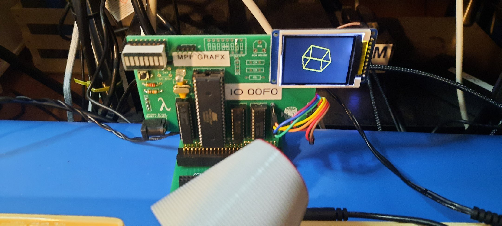
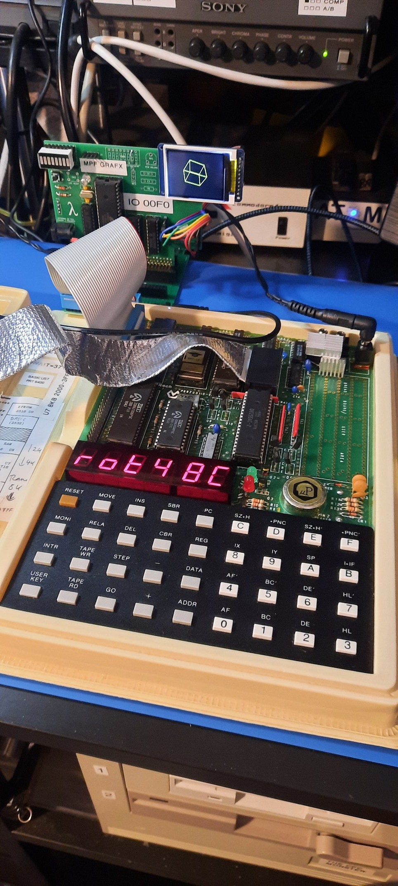
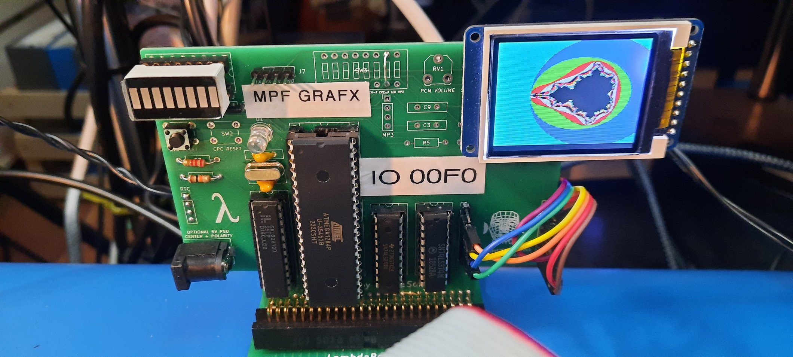
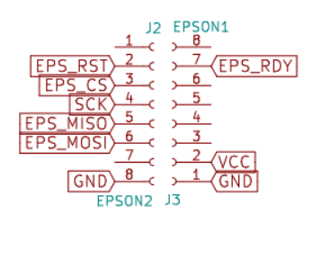
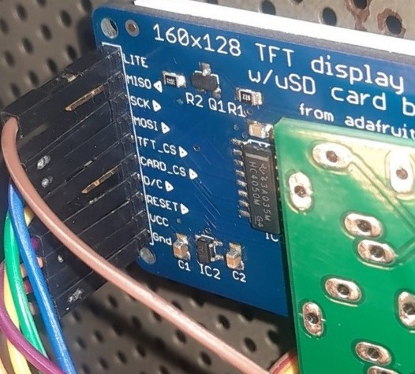
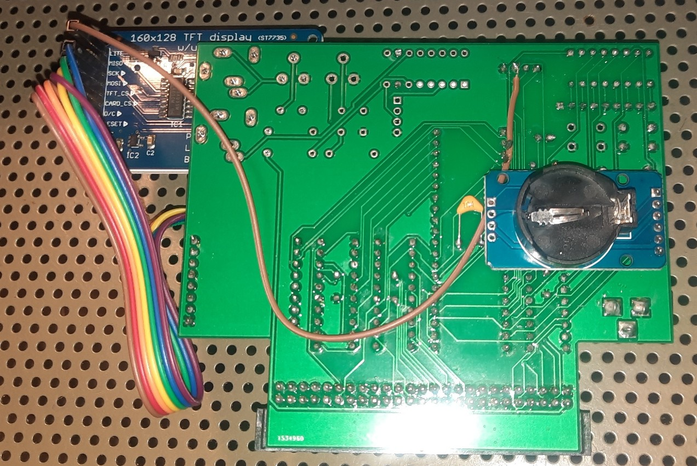
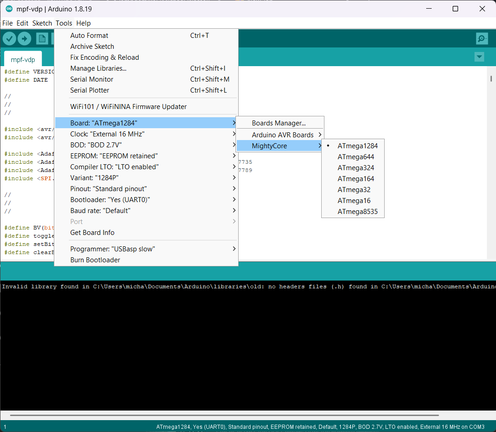

# MPF GRAF-X Card — Microprofessor MPF-1 Graphics Card

MPF GRAF-X card closeup with 3D cube running on the TFT display:



Full system — MPF-1B with GRAF-X card attached:



GRAF-X board running the Mandelbrot ("Appleman") demo:



A custom graphics card for the **Multitech Microprofessor MPF-1B** (circa 1982), adding an [Adafruit 1.8" Color TFT LCD display (ST7735R, 128×160)](https://www.adafruit.com/product/358) driven by an ATmega1284p microcontroller over a Z80 I/O port. Originally developed as a **RetroChallenge 2025/10** entry by **Michael Wessel (LambdaMikel)**.

Hackaday.io project page: https://hackaday.io/project/204153-3d-graphics-on-the-microprofessor-mpf-1b

---

## Overview

The GRAF-X card plugs into the MPF-1 expansion bus and decodes I/O port `0x00F0` using a **GAL22V10** programmable logic device. The Z80 sends graphics commands over this port to an **ATmega1284p**, which drives an **[Adafruit 1.8" Color TFT LCD (ST7735R, 128×160)](https://www.adafruit.com/product/358)** via SPI using the Adafruit GFX library.

The PCB is a repurposed **[LambdaSpeak FS](https://github.com/lambdamikel/LambdaSpeak-FS)** board originally designed for the Amstrad CPC. It already carries the ATmega footprint and an SPI pin header, making it suitable for this project with a small adapter board (gerbers included). To connect the GRAF-X card to the MPF-1 expansion bus, a **[LambdaBoard II](https://github.com/lambdamikel/LambdaBoard)** backplane extender is used.

---

## Hardware

| Component | Details |
|-----------|---------|
| Host | Multitech MPF-1 / MPF-1B (Z80 @ ~1.79 MHz) |
| MCU | ATmega1284p @ 16 MHz external crystal |
| Display | [Adafruit 1.8" Color TFT LCD with MicroSD Breakout (ST7735R, 128×160)](https://www.adafruit.com/product/358) |
| I/O decoder | GAL22V10 (CUPL `.PLD` source in `GAL/`) |
| Base PCB | [LambdaSpeak FS](https://github.com/lambdamikel/LambdaSpeak-FS) for Amstrad CPC (repurposed) |
| Adapter PCB | MPF-1 adapter board (gerbers in `gerbers/`) |

**Why ATmega1284p?** It has 16 KB SRAM (vs. 4 KB on the 644p), which is needed to hold the 8 KB graphics command buffer alongside the Adafruit canvas for double-buffering.

### ATmega1284p Pin Mapping

| Function | Pin |
|----------|-----|
| Z80 data bus input (I0–I7) | PA0–PA7 |
| IOREQ / WRITE strobe | PC7 |
| System RESET from Z80 | PC6 |
| LED status indicator | PC3 |
| SPI SCK | PB7 |
| SPI MOSI | PB5 |
| TFT CS | PB3 |
| TFT RST | PB2 |
| TFT DC | PB0 |
| Z80_RDY (halt/run control) | PB1 |
| Output bus O7–O2 | PD7–PD2 |
| Output bus O1–O0 | PC5–PC4 |

### GAL22V10 — I/O Address Decoder

The `GAL/MPF-VDP-DECODER.PLD` (CUPL source) decodes Z80 I/O port `0x00F0` from 16 address lines and generates:
- `WRITE_OUTPUT` (pin 21): write strobe, active when `IORQ` + `IOWR` asserted at port `0xF0`
- `READ_OUTPUT` (pin 23): read enable (active-low)

The write strobe clocks a 74LS374 flip-flop to latch the 8-bit data byte from the Z80.

### Connecting the TFT Display

The TFT display connects to the LambdaSpeak FS board via DuPont wires from the **J2** and **J3** pin headers. An additional wire from **J7 pin 3** supplies 5V to the display's backlight (`LITE`) — this connection is required; without it the backlight will not illuminate.



| LambdaSpeak FS | TFT Display |
|----------------|-------------|
| J2 pin 1 GND | GND |
| J2 pin 2 EPS_RST | RESET |
| J2 pin 3 EPS_CS | TF_CS |
| J2 pin 4 SCK | SCK |
| J2 pin 6 EPS_MOSI | MOSI |
| J3 pin 2 VCC | VCC |
| J3 pin 7 EPS_RDY | O/C |
| J7 pin 3 VCC | LITE |

Illustration for display connection — DuPont wiring and the 5V LITE wire:





---

## Bill of Materials

| Ref | Component | Value / Part |
|-----|-----------|--------------|
| U4 | Microcontroller | ATmega1284p (DIP-40) |
| U1 | Programmable Logic | GAL22V10B or GAL22V10D |
| U2 | Octal D Flip-Flop | 74LS374 |
| U3 | Octal Bus Buffer | 74LS244 |
| Q1 | Crystal | [16 MHz](https://www.amazon.com/uxcell-Crystal-Oscillators-Resonators-Replacements/dp/B07Y7DVFCW/) |
| C1, C2 | Load capacitors | 22 pF (marked 220) |
| R1 | Resistor | 10 kΩ |
| R7 | LED current-limiting resistor | 2 kΩ |
| RN1 | Resistor array, bused, 9-pin | 1 kΩ |
| J8 | 8-segment LED bar display | — |
| D1 | Status LED | Standard 5 mm, any color |
| J1 | Power jack | 2.1 mm × 5.5 mm barrel-type |
| — | Power supply | 5V 1A DC wall wart, standard Arduino-style 2.1 mm × 5.5 mm barrel plug, center-positive |
| SW3 | GND connection for Segment LED Bar | Wire bridge — upper/lower holes, 7th from left (2nd from right) |
| — | TFT display | [Adafruit 1.8" Color TFT LCD with MicroSD Breakout — ST7735R, 128×160, SPI](https://www.adafruit.com/product/358), connected via DuPont wires |
| — | MPF-1 backplane extender | [LambdaBoard II](https://github.com/lambdamikel/LambdaBoard) — connects GRAF-X card to the MPF-1 expansion bus via provided adapter (see `gerbers/`) |
| — | Bus connector (GRAF-X card) | 2×25 pin male IDC box header, right-angled, 2.54 mm pitch |
| — | Adapter board connectors | Double-row breakable pin headers, 2.54 mm pitch |
| — | General pin headers | Single-row breakable pin headers, 2.54 mm pitch |

---

## Firmware

**File:** `mpf-vdp/mpf-vdp.ino` — Arduino sketch, V1.6 (2025-10-26)

### Arduino / Toolchain Setup

- **Arduino IDE** with **[MightyCore](https://github.com/MCUdude/MightyCore)** board package
- Board: `ATmega1284` — Clock: `External 16 MHz` — Pinout: `Standard` — Variant: `1284P` — BOD: `2.7V` — Bootloader: `Yes (UART0)`
- Libraries (included in `libraries/`):
  - Adafruit GFX Library v1.11.10
  - Adafruit ST7735 and ST7789 Library v1.11.0

To flash, use a standard ISP programmer or the ICSP header on the LambdaSpeak FS PCB.

Arduino IDE board configuration (Tools → Board → MightyCore → ATmega1284):



### How It Works

1. Z80 writes 8-bit command/data bytes to I/O port `0x00F0` via `OUT` instructions.
2. The GAL asserts the write strobe; the ATmega reads the byte on Port A.
3. Commands are pushed into an **8 KB ring buffer** for asynchronous processing.
4. Special control codes (`0xF0–0xFF`) bypass the buffer and execute immediately.
5. Drawing is done via Adafruit GFX into a `GFXcanvas1` (160×128, 1-bit) for **double-buffered** flicker-free output, or directly to the TFT for multi-color single-buffer mode.
6. The ATmega can assert `Z80_RDY` (PB1) to halt the Z80 during frame rendering for synchronization.

### VDP Command Protocol

All values are single bytes sent via Z80 `OUT (0F0h), A`.

**Synchronous (immediate) — `0xF0–0xFF`:**

| Code | Action |
|------|--------|
| `0xFF` | Playback command buffer (start→end index) |
| `0xFE` | Clear command buffer |
| `0xFD` | Reset start index |
| `0xFC` | Enable double-buffering (canvas mode) |
| `0xFB` | Disable double-buffering (direct TFT mode) |
| `0xFA` | Query current buffer index |
| `0xF9` | Set end index to full buffer |
| `0xF8` | Set indexes for full-buffer playback |
| `0xF7/0xF6` | Enable/disable buffer status overlay |
| `0xF5` | Immediate screen clear |
| `0xF4` | Immediate bitmap copy to TFT |
| `0xF3/0xF2` | Set sync background/foreground color (palette) |
| `0xF1/0xF0` | Set end/start index (reads next byte as arg) |

**Buffered drawing commands:**

| Code | Action | Args |
|------|--------|------|
| `0x80` | Clear screen black | — |
| `0x81` | Clear screen with current color | — |
| `0x82` | Set palette color | palette index (0–8) |
| `0x83` | Set raw color | color byte |
| `0x84` | Copy canvas to TFT (sync point) | — |
| `0x85` | Pause | duration (×100 ms) |
| `0x90` | Plot pixel (palette) | x, y, palette |
| `0x91` | Plot pixel (raw color) | x, y, color |
| `0x92/0x93` | Plot pixel at alt coords | x1, y1, [palette\|color] |
| `0xA0` | Draw line | x1, y1, x2, y2 |
| `0xA1` | Line from previous endpoint | x2, y2 |
| `0xA3/0xA4` | Line with explicit color | x1, y1, x2, y2, [palette\|color] |
| `0xA5/0xA6` | Line from prev endpoint + color | x2, y2, [palette\|color] |
| `0xB0` | Print char at position | x, y, char |
| `0xC0` | Set text size | size |
| `0xC1` | Set cursor | x, y |
| `0xC2` | Print char at cursor | char |
| `0xC3` | Text wrap on/off | 0/1 |
| `0xD0/0xD1` | Print null-terminated string (with/without newline) | bytes…, 0x00 |
| `0xE0/0xE1` | Set background color | [palette\|raw color] |

**Color palette (indices 0–8):** Black, White, Red, Green, Blue, Cyan, Magenta, Yellow, Orange.

---

## Z80 Assembly Demos

All programs in `mpf-z80-asm/` target the MPF-1's Z80 and communicate with the GRAF-X card via `OUT (0F0h)` instructions.

| File | Description |
|------|-------------|
| `cube3.asm` | **3D rotating cube** — the main RC2025/10 demo. Uses fixed-point 8.8 arithmetic, SIN/COS lookup tables, and matrix rotation around X/Y/Z axes. Interactive: keypad controls rotation speed, zoom, and axis. Supports record/playback of 256-byte operation sequences for smooth auto-rotation. Ported from [Brian Chiaha's Z80 LCD Graphics Library](https://github.com/bchiha/Z80_LCD_128x64_Graphics_Library). |
| `mandelb.asm` | Mandelbrot set generator ("Appleman") using 16-bit fixed-point math. Plots the full set with iteration-based coloring. |
| `mandelg.asm` | Interactive Mandelbrot ("Appleman") — prompts user for iteration depth before rendering. |
| `mandelrom.asm` | ROM-resident Mandelbrot (assembled at `0x7000`). |
| `net.asm` | Diagonal net graphics demo — draws a geometric diagonal grid of lines. |
| `cnet.asm` | Diagonal net graphics demo with color cycling — same pattern as `net.asm` rendered in different colors. |
| `game.asm` | Number guessing game (0–1023) with human-vs-computer modes, speech synthesis output, and VDP score display. |

---

## Assembling and Running the Demo Programs

### Assembling with Zmac

The `.asm` source files are assembled using **[Zmac](https://github.com/sehugg/zmac)**, a Z80 macro cross-assembler. Run it from the directory containing the `.asm` file:

```sh
./zmac.exe cube3.asm
```

Zmac creates a `zout/` subdirectory and places the output files there, including an Intel HEX `.hex` file and a `.lst` listing.

### Preparing the HEX file for PicoRAM

PicoRAM expects a stripped-down version of the HEX file. Open the generated file in `zout/` and make two edits to every data line:

1. **Remove the leading record marker and address field** — delete the `:10180000`, `:10181000` etc. prefix at the start of each line.
2. **Remove the trailing checksum byte** — delete the last two hex characters at the end of each line.

A raw Intel HEX data line looks like this:

```
:10180000 AF 01 F0 00 ... 42   ← remove :10180000 (address) and 42 (checksum)
```

After editing it should contain only the raw data bytes for that line.

Save the edited file into the **root folder of the PicoRAM SD card** with a descriptive name ending in `.RAM`, for example `CUBE3.RAM`. PicoRAM will present it in its file browser and load it directly into the MPF-1's address space when selected.

### Loading programs with PicoRAM

The most convenient way to transfer programs to the MPF-1 is via **PicoRAM** — a Raspberry Pi Pico-based RAM emulator with an SD card slot that plugs directly into the MPF-1's RAM socket. You copy the assembled `.HEX` file onto an SD card on your PC, insert it into the PicoRAM, and the MPF-1 boots straight from it — no tape loading or manual hex entry required.

Two variants are available:

- **[PicoRAM 6116](https://github.com/lambdamikel/picoram6116)** — dedicated to the Microprofessor MPF-1B / MPF-1P, emulates the 6116 SRAM
- **[PicoRAM Ultimate](https://github.com/lambdamikel/picoram-ultimate)** — multi-machine version supporting several vintage single-board computers including the MPF-1

Once the file is loaded, execute the program from the MPF-1 keypad: press `ADDR`, enter the load address (e.g. `1800`), then press `GO`.

---

## First Steps — Programming the GRAF-X

`net.asm` is an ideal first program to study because it is short, self-contained, and exercises the core VDP commands directly.

### What it does

The program draws a diagonal net pattern on the display: a series of lines sweeping from the top edge to the bottom edge of the screen, with both the step size and the color chosen interactively by the user before drawing begins.

### Running it

Assemble and load `net.asm` at address `$1800` on the MPF-1, then execute from there (`ADDR` → `1800` → `GO`).

The MPF-1's 7-segment display will first show **`PEtS`** (step), prompting you to press a key (0–9) to choose how many pixels apart each line will be. It then shows **`roloC`** (color), prompting you to press a key to select a palette color (0 = black, 1 = white, 2 = red … 8 = orange, see palette table above). After both inputs the drawing starts immediately.

### How it works — annotated VDP commands

**1. Initialisation**

```asm
ld a, $fe  \ out (c), a   ; Clear the command buffer
ld a, $80  \ out (c), a   ; Clear screen to black
ld a, $ff  \ out (c), a   ; Execute (flush/draw buffer)
```

**2. Set the drawing color**

```asm
ld a, $82  \ out (c), a   ; Command: set palette color
ld a, (col) \ out (c), a  ; Argument: palette index chosen by user
ld a, $ff  \ out (c), a   ; Execute
```

**3. The drawing loop**

Two registers track the moving endpoints:
- **H** — x-coordinate of the line's start point (top edge), increments by `step` after each full sweep
- **D** — x-coordinate of the line's end point (bottom edge), increments by `step` every iteration

Each call to `line` sends command `$A0` followed by four coordinate bytes (x1, y1, x2, y2):

```asm
ld a, $a0 \ out (c), a   ; Command: draw line
out (c), h               ; x1 = H  (start, top edge, moves right each sweep)
ld a, 0   \ out (c), a   ; y1 = 0  (always top of screen)
out (c), d               ; x2 = D  (end, bottom edge, increments each line)
ld a, 127 \ out (c), a   ; y2 = 127 (always bottom of screen)
ld a, $ff \ out (c), a   ; Execute
```

D sweeps from 0 to 159 (the full screen height), producing a fan of lines from the same top point to every point along the bottom. Once D wraps, H advances by `step` and the fan origin shifts right — this is what produces the diagonal net pattern.

After a complete pass (both H and D have swept 0→159), the program jumps back to `main` and prompts for new inputs, so the net redraws indefinitely.

### Key takeaways for your own programs

- Every VDP command byte is sent with `OUT (C), A` where `BC = $00F0`.
- Multi-byte commands (like draw line) send the command code first, then each argument byte in order, each with its own `OUT`.
- Finishing with `$FF` triggers execution of the buffered commands.
- A short `delay` call between each `OUT` is needed to give the ATmega time to read and buffer each byte reliably.

---

## Repository Structure

```
mpf-vdp/            Arduino VDP firmware (mpf-vdp.ino)
mpf-z80-asm/        Z80 assembly source files
GAL/                GAL22V10 CUPL source (.PLD) and documentation (.PDF)
gerbers/            PCB gerbers — adapter board and LambdaSpeak FS reference
libraries/          Adafruit GFX and ST7735/ST7789 libraries (local copies)
```

---

## Demo Videos

**RC2025/10 Final Entry — Double-Buffered 3D Cube on the MPF-1B** (`cube3.asm`):

[](https://youtu.be/Wn0jLz8E0A0)

**Number Guessing Game** (`game.asm`):

[](https://www.youtube.com/watch?v=GEUAW2D05yk)

**Diagonal Net Graphics Demo** (`net.asm`):

[](https://youtu.be/RzFA0sdjWBw)

**Mandelbrot Set ("Appleman") Demos** (`mandelb.asm`, `mandelg.asm`):

[](https://youtu.be/yPdWpgQ05P0)

Full RetroChallenge 2025/10 playlist: https://www.youtube.com/playlist?list=PLvdXKcHrGqhekP-rgW2OoxKdeRROMkYVK

---

## Credits

- **Michael Wessel (LambdaMikel)** — GRAF-X card hardware, ATmega firmware, Z80 demos
- **[Claude Code](https://claude.ai/code) (claude-sonnet-4-6)** — authored this README
- **Brian Chiaha** — Original Z80 3D cube / LCD graphics library (ported for cube3.asm)
- **Adafruit** — GFX and ST7735/ST7789 display libraries
- **[LambdaSpeak FS](https://github.com/lambdamikel/LambdaSpeak-FS) PCB** — Base board repurposed for this project
